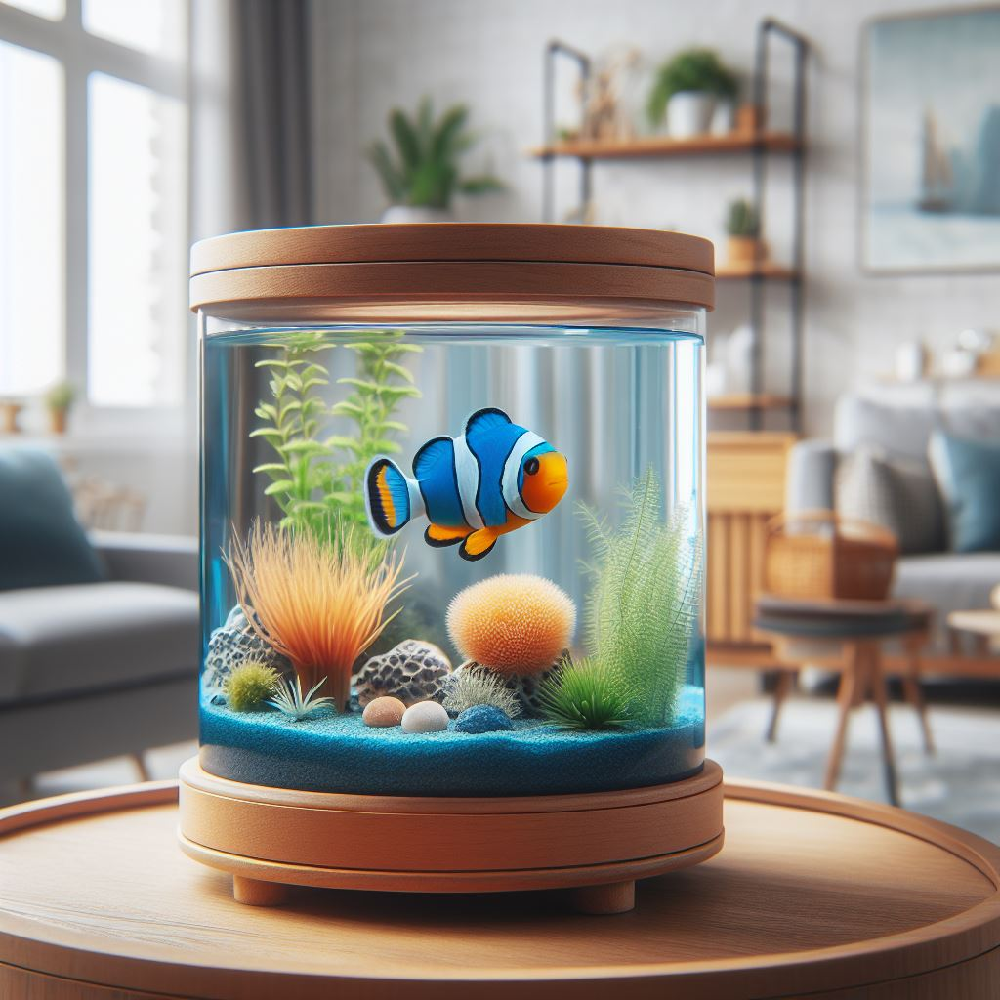
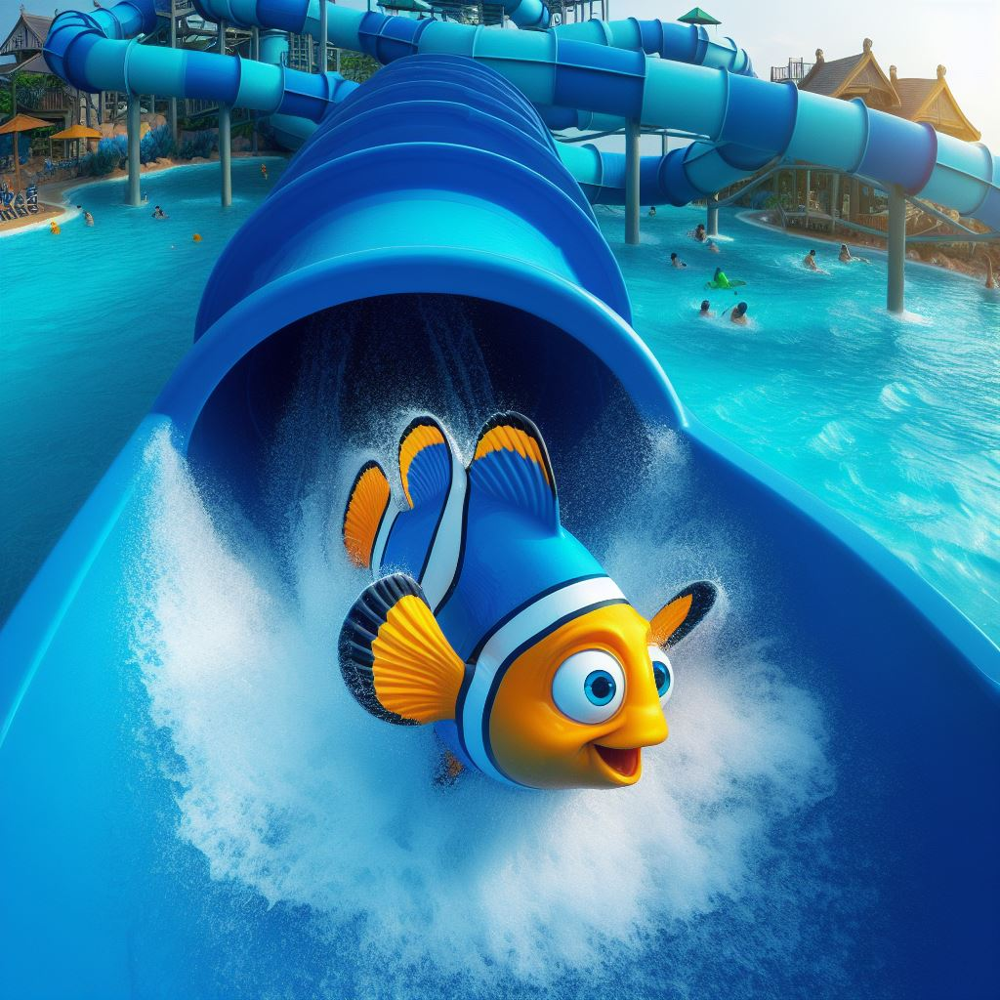

## Sujet

On souhaite créer un programme qui est capable de génerer une variation d'une image. On lui fournis une image d'origine, un prompt de modification et l'IA fournis un prompt de sortie et l'image associée.

Le but est la modification de style, la recontextualisation de personnages et d'objet.

::: example
  Exemple : On part avec la photo et le prompt suivant :

  { width=40% }

  > Mettre le poisson dans un toboggan de parc aquatique et qui fait un salto

  L'IA doit donner ceci :

  { width=40% }

  > Un poisson clown bleu et jaune dans un toboggan de parc aquatique qui fait un salto
:::

On est limité par les coûts à l'utilisation, et on peut uniquement utiliser Azure et OpenAI (avec parcimonie). On peut utiliser Azure pour l'entrainement mais on doit l'utiliser peu lors de l'execution du programme final.

### Logiciels de rédaction

On souhaite utiliser pour rédiger:

* Pandoc par @pandoc
* Zotero par @zotero
* Tectonic (optionel)

Je vous conseil les extensions suivantes pour simplifier votre tâche :

* [VSCode] Markdown Preview Enhanced par @markdownpreviewenhanced
* [VSCode] Citation Picker par @citationpicker
* [Zotero] Better BibTeX par @betterbibtex

## Etat de l'art

## Architechture

## etc
